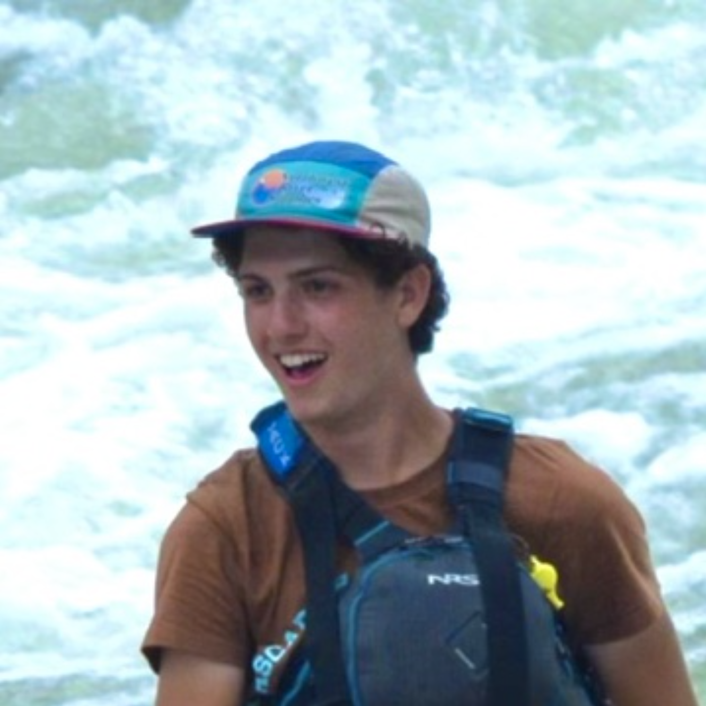
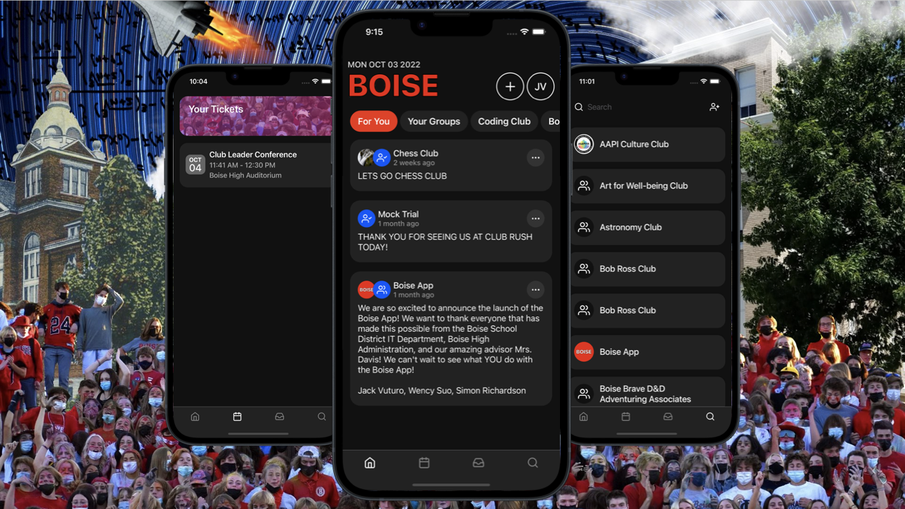
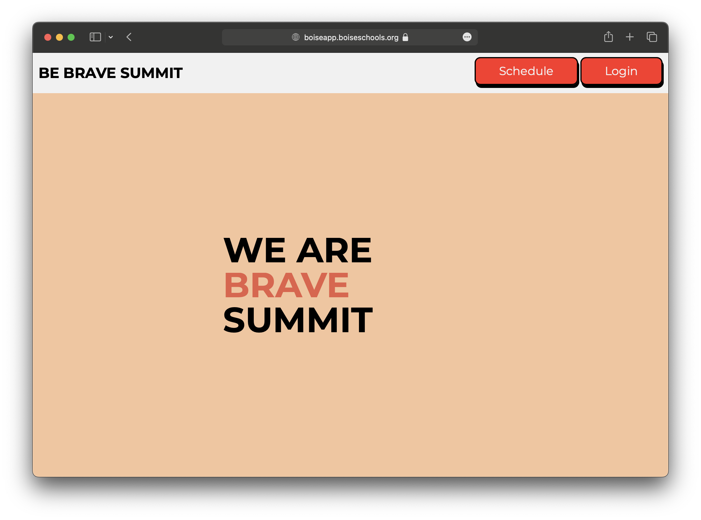

<!-- rounded circle profile image -->

# Jack Vuturo's Portfolio

## About Me
I am a student at the Boise State University studying Computer Science. I am currently a first-year student and will be graduating in May 2026.

## Projects

### Boise High School App

While in high school, I worked with a team of students to create an app for our school. The app was designed to help students get involved in school clubs and organizations. The app was created using React Native and a Flask backend. I did most of the development of the app, including the UI and backend. The app is currently available on the [Google Play Store]() and the [Apple App Store](https://apps.apple.com/us/app/boise-app/id1567064412).

### Boise High School SummitPass

My Senior year of high school I designed and developed a website for the Boise High School "Be Brave Summit" program. The website helped students find breakout session at the confrence like event and help keep track of attendence through out the day for school administators. The website was created using HTML, CSS, Javascript and a Flask backend. I did most of the development of the website, including the UI and backend. The website is currently available at [https://boiseapp.boiseschools.org/summit](https://boiseapp.boiseschools.org/summit/schedule).

